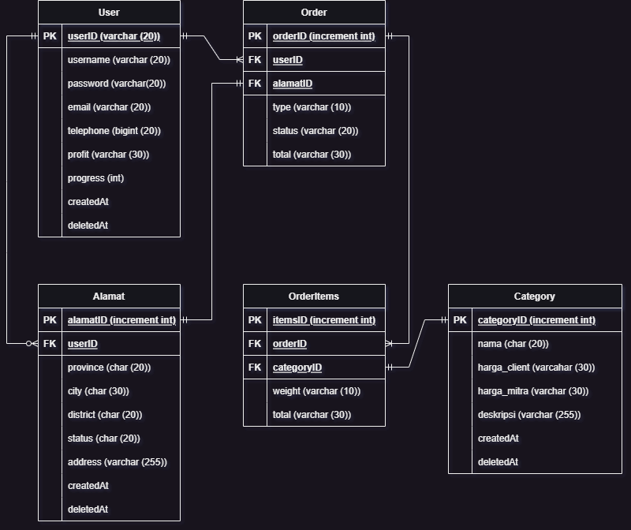

# API For [Rozhok App](https://github.com/capstone-rozhok-app/Rozhok)

## Endpoint for user Client

### Flow Client Sell Junk

Swagger [here](https://app.swaggerhub.com/apis/AdithiaSandi/Thrive-Capstone/1.0.0#/)

